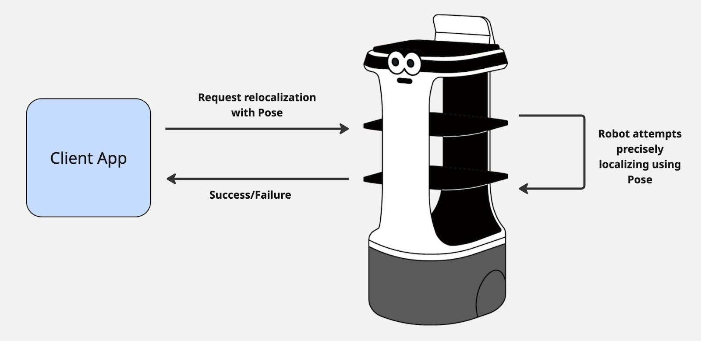

# Localization

Localization status is to see whether the robot “knows” where it is in the map.
This is critical for operation, as the robot needs to have an accurate
understanding of its place in the environment in order to navigate reliably.
Once localized, our robots are able to keep themselves localized as they move
through an environment, using sensor data to compare what it sees to what is on
its map. This means it only needs to figure out where it is once, and can stay
localized from there. A robot may become delocalized, meaning it has lost track
of where it is in the map. This can happen for various reasons, such as:

1. It cannot find walls or landmarks from its map in the sensor data
   1. Often because walls are obscured by lots of new obstacles
1. It encounters an area that looks very similar to many other locations in the
   map
   1. For example, a long featureless hallway looks the same to the sensors from
      many different places
1. It faces significant slippage of the wheels
   1. This is more rare as we have compensation for wheel slip, but if
      significant enough, it can confuse the robot

In the event of delocalizing, the user will need to trigger localization again
to tell the robot where it is, before having it navigate again.

Some clear definitions for localization terminology are as follows:

1. Localized
   1. Robot knows where it is in the environment
1. Localizing
   1. Robot is currently running a process to figure out where it is
   1. Currently our API does this with a hint about its position, given by the
      user
   1. Eventually this hint will not be required, and robot can do the initial
      localization on its own
1. Delocalized
   1. Robot has lost track of where it is in the environment
   1. Likely this means it cannot navigate anymore
   1. In this event, the user will need to localize the robot again to tell the
      robot its current location
1. Pose
   1. The x-y coordinate on the robot’s map
   1. This is used frequently to say either where the robot is, or for telling
      the robot where it is on the map

We supply a mechanism for triggering a robot localization. This means the user
tells the robot an estimation of where the robot is in the map (using a Pose),
and the robot uses this guess to more accurately find its place. If the
localization process is a success, it returns Success state. If the localization
process fails, it will return Failed state, meaning the robot is not able to
start driving autonomously.

