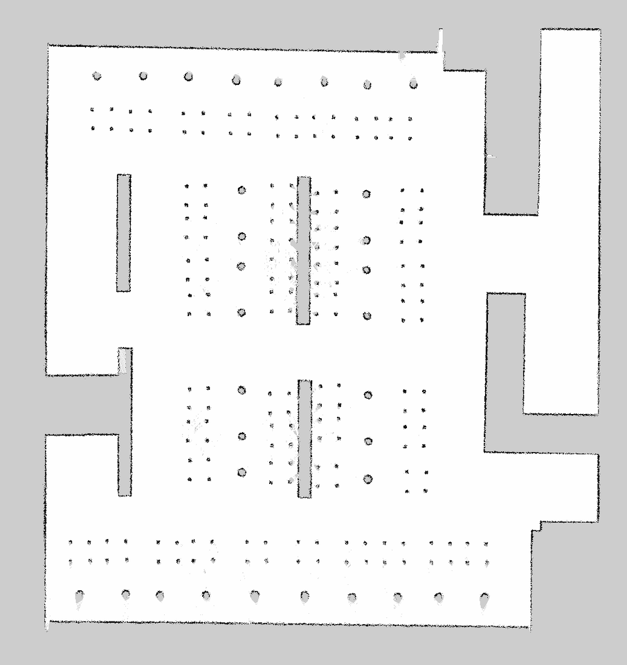
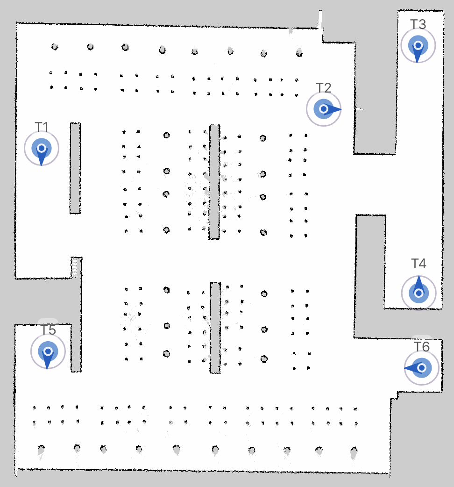

# Location

The location represents a site where a robot is operating. This is accessible
from the [Universe](https://universe.bearrobotics.ai/) platform. A robot must be
paired to a location and supplied with a map before it can operate with the full
suite of Mission and Navigation API.
The location represents a site where a robot is operating. This is accessible
from the [Bear Fleet Managment](https://universe.bearrobotics.ai/)
(a.k.a. Universe) platform. A robot must be paired to a location and supplied
with a map before it can operate with the full suite of Mission and Navigation
API.

## Location Registration & Synchronization

Before a robot may synchronize with the Universe platform, the robot must be
paired with the Bear Fleet Management. For robots running Bear’s touchscreen
app, this will be part of the setup process that is presented during the first
bootup. The process is referred to as Location Registration.

When a robot is paired to a location, it synchronizes its location with the
Universe platform once upon bootup. Therefore, if any changes to the map are
made in the Universe map editor, the robot must be rebooted to synchronize the
robot with the updated map.

## Maps

A map is a visual and annotated representation of a given area at a robot site.
Maps consist of 3 components:

- Image: A PNG graphic of the site.
- Metadata: Metadata related to the PNG itself, including scaling and origin.
- Annotations: User-defined aspects of the map such as Destinations.

### PNG Image

This is provided as a PNG image. The graphic itself is represented by three
colors:

- White: This is a traversable space the robot may move across.
- Black: This is an occupied space that the robot will expect to be blocked.
- Gray: Unmapped area.

The following is an example map of what a restaurant site may look like:

Objects are represented based on a horizontal scan from the robot's LiDAR sensor
mounted on the base of the robot. The map in the above example contains chairs
and tables. Due to the height of where the LiDAR sensor is mounted, chairs are
represented by their legs as a square arrangement of 4 points, while tables are
only visible by their slightly wider center column.

### Metadata

The metadata of a map image is data relevant for rendering the image and how
coordinates of the robot should be positioned relative to the image itself.

### Annotation

Users may add custom properties to a map, called annotations. This is
accessible from the Map editing page in Universe.

#### Destination

This is the most common annotation type. This is represented as some ID that is
associated to a user-defined Pose on the map. Destinations are primarily used
as points of interest that can be provided to operate with Mission.
Additionally, the underlying pose is something that can be supplied to do
Navigation-related operations.

The following graphic is the same map but annotated with some destinations:

Each destination is a 2D point on the map with a direction associated with it,
represented as a yaw value radians.
