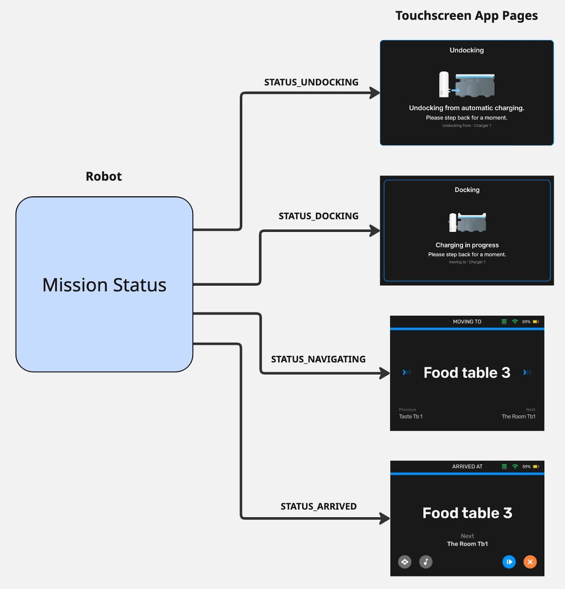

# Missions

Missions are the main way we tell our robot to do work. They describe a set of
actions and behaviors (move, wait for trigger, play sound, etc) that define how
a robot accomplishes a workflow. Missions handle both simple workflows (navigate
to destination) and complex workflows (navigate to multiple destinations,
waiting at each one for certain triggers), depending on the mission type.

## Destinations

Most missions utilize destinations supplied by the user. A destination defines a
place in the robot’s map that we want the robot to either go to, or do some
action with. This destination at the least will define a coordinate place in the
map, and may also include more information detailing some of the work the
mission has to do there. Some mission types only support a single destination,
while other more complex missions support multiple destinations.

## Mission Types

A mission type tells us what kind of mission behaviors will be executed on the
robot. As mentioned, missions can have very little complexity or a lot depending
on how much logic the user wants the robot to execute. This allows developers to
choose whether they want to delegate the workflow of the robot to a more complex
mission, or manage more of the logic in their app and use smaller missions with
less logic. Bear provides several pre-defined mission types, available through
the API. These range from some simple mission types shared across all robot
families, to some more complex missions exposed only to their respective robot
family.

For example, a user wanting a Servi-family robot to complete a restaurant
delivery workflow could make use of a DeliveryMission. This has logic to take
several destinations (positions in the map), navigate to each one, and wait for
food to be removed before moving onto the next destination. It also includes
things like prompting the customer to remove food, and other quality-of-life
behaviors for the restaurant delivery use-case. This is useful for things like
touchscreen control apps, allowing your application to send simple mission
requests to accomplish a restaurant workflow, without much logic in the
application itself.

Alternatively, you may want more control over the robot’s behavior, and want to
trigger things through your own app instead. Using a simpler mission like
NavigateMission (which just navigates to a single destination before finishing),
you can tell the robot to just move to a destination, and have your app decide
when to send the next navigation to a destination. This is useful for when you
have a fleet manager dispatching robots, and need full control of the exact
actions and timings for the robots.

The types of missions available are filtered per-robot-family, meaning that each
family has a select set of missions the user can send it. This is to ensure only
missions relevant to that robot family are available (it does not make sense to
send a BussingMission to a Carti600 robot).

## Command

Mission Commands are high-level controls for an overall mission. When a mission
is created, commands are available for users to control the execution of that
mission. The high-level commands are:

### Cancel

- Stops mission execution and returns robot to Idle
- Logs in our system as a Cancelled mission, which can be useful for tracking
  user-cancelled missions

### Pause

- Pauses execution of the mission, without resetting it

### Resume

- Resumes execution of the mission, picking up from the point it left off

### Finish

- Stops mission execution and returns robot to Idle
- Logs in our system as a Successful mission, allowing user to specify that this
  was not ended due to errors or issues

## Mission Queue

Our mission system supports a mission queue, which gives users the ability to
queue up multiple missions that execute one after another. Missions can be added
with the `Append` API, and each mission will start executing as soon as the
previous mission in the queue is in terminal state.

Further down our roadmap, we will expand this functionality to allow for more
powerful tools around this queue, including removing missions, inserting, and
getting the current list of missions in the queue.

## Status

Mission Status is the overall execution state of the mission. It tells us
whether the mission is running, and if not, what state it ended the mission in.
This is useful for understanding whether a command you sent correctly
stopped/paused/resumed the mission, and whether the mission completed in error
or not. This state is universal to all missions, and does not describe details
about what the mission internally is doing. The high-level states are:

### Running

- Mission is currently executing normally, either from mission starting or user
  Resume command

### Paused

- Mission was paused by user Pause command

### Cancelled

- Mission was cancelled by user Cancel command

### Succeded

- Mission completed normally, either by completing the behaviors in the mission
  or by user Finish command

### Failed

- Mission failed to complete due to internal error/failure in the mission

## Feedback

While status provides us with the overall execution state of the mission, it
doesn’t give us details of what is happening during a mission. To achieve this,
we have a Feedback field in our Mission Status which describes what the mission
internally is doing. This feedback, similar to our mission types, is
per-robot-family, meaning we have a single Feedback msg type for all missions in
a given robot family. This ensures clients can have stable feedback despite many
different mission types being available to send to the robot.

Missions will populate information in the feedback as they are available. For
example, given the following definition for Servi robot-family feedback:

```proto
// Servi Robot-Family Feedback
message Feedback {
  enum Status {
    STATUS_UNKNOWN = 0;
    STATUS_NAVIGATING = 1;
    STATUS_ARRIVED = 2;
    STATUS_DOCKING = 3;
    STATUS_UNDOCKING = 4;
  }
  Status status = 1;
}
```

This covers all potential states our missions can report to the client. However,
not all missions are guaranteed to utilize all of these states. A
NavigateMission may not have `STATUS_ARRIVED`, as it only contains
`STATUS_NAVIGATE` before the mission ends.

With this in mind, clients should build their applications to handle cases where
states may show up in different orders, and all states may not even show up.
Clients should not build applications that depend heavily on the ordering that
each of these states arrive at, as different missions may have different
behaviors in different orders. Building an application that relies on this means
the mission cannot change without potentially breaking the client app.

A better way is to build your app such that it has handling for every possible
state for Servi Feedback. That way no matter what mission you send, and what
order the states appear, your app can properly adapt. A good example of this is
building a touchscreen application to show mission feedback. If the touchscreen
app has a dedicated page for each state, it can simply show the correct screen
corresponding to a given status reported by the mission. If the Docking status
never shows up, the screen simply does not display. This is resilient to changes
in mission behavior as the application does not care what order or which
statuses within the feedback show up.


