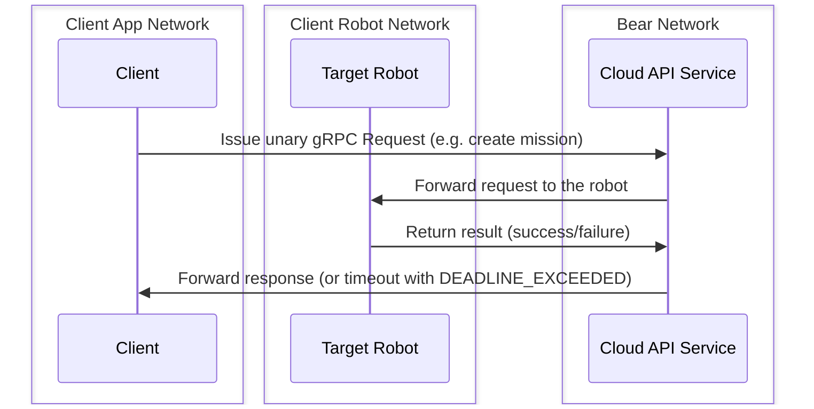
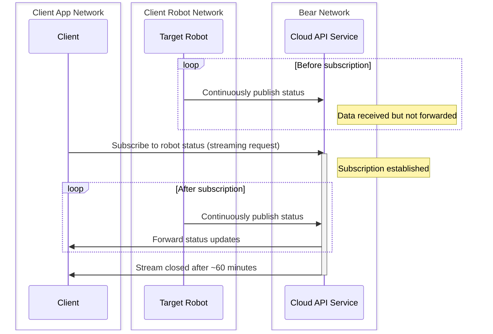

# Overview

This document describes the [gRPC](https://grpc.io/docs/what-is-grpc/introduction)-based Bear Cloud API Service for third-party clients. The Bear Cloud API service enables third parties to:

1. Send commands to control the robots (e.g., mission creation/cancellation)
2. Receive status updates from robots (e.g., tray status, battery status)
3. Retrieve robot/location information

There are two different types of RPCs available, **unary** and **server-side streaming RPCs** as listed below. For a detailed list of API capabilities, please navigate through the [gRPC API Reference](v1.0/resources/Mission.md).

!!! note
    Messages have **delivery guarantees (i.e. QoS) of [best effort](https://en.wikipedia.org/wiki/Best-effort_delivery) and not at least once**. This means that some messages can be dropped and not delivered to clients due to multiple reasons such as, but not limited to, packet loss, network traffic load, and processing failures.

## Unary RPCs

[Unary RPCs](https://grpc.io/docs/what-is-grpc/core-concepts/#unary-rpc) are used for request/response-type communication, like creating a new mission.

The following sequence diagram illustrates how a single unary request is propagated from a client to a target robot through the Bear Cloud API service:

## Streaming RPCs

[Server-side streaming RPCs](https://grpc.io/docs/what-is-grpc/core-concepts/#server-streaming-rpc) are used for receiving continuous updates, either event-based (e.g., mission status) or frequency-based (e.g., robot pose).

!!! note

    - Streams will persist for a maximum of **60 minutes**. To maintain long-lived subscriptions, a conditional retry should be implemented.

The following sequence diagram illustrates how streaming data flows from a robot to a client through the Bear Cloud API service:

For server streaming RPCs, all responses include metadata containing a timestamp and a sequence number:

- **Timestamp**: The timestamp is based on the local clock where the response was generated and is not globally synchronized, so it should not be used for global ordering across different robots.
- **Sequence Number**: The sequence number is guaranteed to be incremental and can be used to detect duplicate responses. Note that the sequence number may reset to 0 at any time, though this should be rare (e.g., only during a service or robot restart).

If strict detection of response duplication is desired, both the sequence number and timestamp should be used together. 

