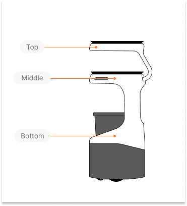
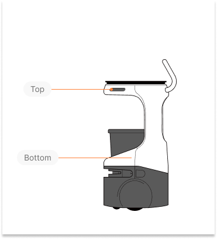

These endpoints and their message types are only available for the Servi robot family. Attempting to run a Servi commands on a non Servi robot will result in an INVALID_ARGUMENT error.


------------
## CreateMission 
Use the shared `CreateMission` endpoint to send missions for Servi robots. Servi-specific missions must be sent using the appropriate request message format. <br/>

!!! Note
    When sending a Servi mission, `servi.Feedback` is returned in [`SubscribeMissionStatus`](Mission.md#subscribemissionstatus) response message.
    
    ##### servi.Feedback `enum`

    | Name                   | Number | Description                                      |
    |------------------------|--------|--------------------------------------------------|
    | STATUS_UNKNOWN         | 0      | Default value. It means `status` field is not returned. |
    | STATUS_NAVIGATING      | 1      | The robot is currently navigating to its goal.|
    | STATUS_ARRIVED         | 2      | The robot has arrived at a goal. |
    | STATUS_DOCKING     | 3      | The robot is performing a docking maneuver.|
    | STATUS_UNDOCKING         | 4      | The robot is performing an undocking maneuver.|


### Request
##### robot_id `string` `required`
The ID of the robot that will receive this command.


##### mission [`Mission`](Mission.md#mission-mission-required) `required`
Use the field `servi_mission` to create and send a mission. Current API version supports 4 types of Servi mission.

**BussingMission** <br />
A bussing mission that navigates to one or more goals, stopping at each for a time limit or until weight is added.

| Field | Message Type | Description |
|------|------|-------------|
|`goals`| List of`Goal` <br />`required`| a list of [`Goal`](Mission.md#goal-goal-required) |
|`params`|`BussingParams` <br />`optional`|  ***There is no param defined in this API version.*** |

**BussingPatrolMission** <br />
A bussing patrol mission that continuously loops through goals, stopping at each for a time limit until weight exceeds a threshold.

| Field | Message Type | Description |
|------|------|-------------|
|`goals`| List of `Goal` <br />`required`| a list of [`Goal`](Mission.md#goal-goal-required) |
|`params`|`BussingPatrolParams` <br />`optional`|  ***There is no param defined in this API version.*** |

**DeliveryMission** <br />
A delivery mission that navigates to one or more goals, stopping at each for a time limit or until weight is removed.

| Field | Message Type | Description |
|------|------|-------------|
|`goals`| List of `Goal` <br />`required`| a list of [`Goal`](Mission.md#goal-goal-required) |
|`params`|`DeliveryParams` <br />`optional`|  ***There is no param defined in this API version.*** |

**DeliveryPatrolMission** <br />
A delivery patrol mission that continuously loops through goals, stopping at each for a time limit until all weight is removed.

| Field | Message Type | Description |
|------|------|-------------|
|`goals`| List of `Goal` <br />`required`| a list of [`Goal`](Mission.md#goal-goal-required) |
|`params`|`DeliveryPatrolParams` <br />`optional`|  ***There is no param defined in this API version.*** |

**Refer to the [examples](#examples) for how to create and send a Carti mission.**

### Response
##### **mission_id** `string`
The ID of the mission created. 

### Errors

| ErrorCode  | Description |
|------------|-------------|
|`INVALID_ARGUMENT`      | This command is sending to is not a Carti family robot. |
|`FAILED_PRECONDITION`   |  The robot is already executing another mission. <br /> This command is valid if current mission is in [terminal state](#state-enum), <br /> e.g Cancelled, Succeeded, Failed. |

### Examples
=== "Go"
    ```go
    package main

    import (
      "context"
      "fmt"
      "log"
      "time"

      "google.golang.org/grpc"
      "google.golang.org/grpc/metadata"

      corepb "your_project_path/bearrobotics/api/v1/core"
      servicespb "your_project_path/bearrobotics/api/v1/services"
    )

    func GetToken() (string, error) {
      // Fetch your API key JWT and return it as a string.
    }

    func createChannelWithCredentialsRefresh() (*grpc.ClientConn, context.CancelFunc, error) {
      // Return a secure gRPC channel with credentials.
    }

    func createBussingMission() {
      token, err := GetToken()
      if err != nil {
        log.Fatalf("Failed to get token: %v", err)
      }

      conn, cancel, err := createChannelWithCredentialsRefresh()
      if err != nil {
        log.Fatalf("Failed to create channel: %v", err)
      }
      defer cancel()
      defer conn.Close()

      stub := servicespb.NewServicesClient(conn)

      ctx, cancelCtx := context.WithTimeout(context.Background(), 5*time.Second)
      defer cancelCtx()
      ctx = metadata.AppendToOutgoingContext(ctx, "authorization", "Bearer "+token)

      req := &corepb.CreateMissionRequest{
        RobotId: "pennybot-456efg",
        Mission: &corepb.Mission{
          Mission: &corepb.Mission_BussingMission{
            BussingMission: &corepb.BussingMission{
              Goals: []*corepb.Goal{
                {
                  Goal: &corepb.Goal_DestinationId{
                    DestinationId: "pickup-table-1",
                  },
                },
                {
                  Goal: &corepb.Goal_DestinationId{
                    DestinationId: "dropoff-station-3",
                  },
                },
              },
              Params: &corepb.BussingParams{},
            },
          },
        },
      }

      resp, err := stub.CreateMission(ctx, req)
      if err != nil {
        log.Fatalf("CreateMission failed: %v", err)
      }

      fmt.Println("Created mission ID:", resp.MissionId)
    }

    func main() {
      createBussingMission()
    }
    ```

=== "Python gRPC"
    ```python
    import grpc
    from bearrobotics.api.v1 import core_pb2
    from bearrobotics.api.v1 import services_pb2_grpc

    def get_token():
        # Fetch your API key JWT
        pass

    def create_channel_with_credentials_refresh():
        # Return a secure gRPC channel
        pass

    def create_bussing_mission():
        try:
            token = get_token()
            channel = create_channel_with_credentials_refresh()
            stub = services_pb2_grpc.ServicesStub(channel)

            request = core_pb2.CreateMissionRequest(
                robot_id="pennybot-456efg",
                mission=core_pb2.Mission(
                    bussing_mission=core_pb2.BussingMission(
                        goals=[
                            core_pb2.Goal(destination_id="pickup-table-1"),
                            core_pb2.Goal(destination_id="dropoff-station-3")
                        ],
                        params=core_pb2.BussingParams()
                    )
                )
            )

            metadata = [("authorization", f"Bearer {token}")]
            response = stub.CreateMission(request, metadata=metadata)
            print("Created mission ID:", response.mission_id)

        except grpc.RpcError as e:
            print(f"gRPC error: {e.code().name} - {e.details()}")
        except Exception as ex:
            print(f"Unexpected error: {type(ex).__name__} - {ex}")
    ```

=== "gRPCurl"
    ```bash
    grpcurl \
      -proto bearrobotics/api/v1/services/cloud_api_service.proto \
      -import-path protos \
      -d '{
        "robot_id": "pennybot-456efg",
        "mission": {
          "bussingMission": {
            "goals": [
              { "destinationId": "pickup-table-1" },
              { "destinationId": "dropoff-station-3" }
            ],
            "params": {}
          }
        }
      }' \
      api.bearrobotics.api:443 \
      bearrobotics.api.v1.services.cloud.APIService.CreateMission
    ```

=== "Protobuf"
    ###### Refer to our [public protobuf repo](https://github.com/bearrobotics-public/cloud/tree/v1.0) for actual package names and full definitions.
    ```proto
    message Pose {
      float x_meters = 1;
      float y_meters = 2;
      float heading_radians = 3;
    }

    message Goal {
      oneof goal {
        string destination_id = 1;
        Pose pose = 2;
      }
    }

    message BussingParams {}

    message BussingMission {
      repeated core.Goal goals = 1;  
      BussingParams params = 2;
    }

    message servi.Mission {
      oneof mission {
        DeliveryMission delivery_mission = 1;
        BussingMission bussing_mission = 2;
        DeliveryPatrolMission delivery_patrol_mission = 3;
        BussingPatrolMission bussing_patrol_mission = 4;
        servi.Mission servi_mission = 5;
      }
    }

    message CreateMissionRequest {
      string robot_id = 1;
      core.Mission mission = 2;
    }

    message CreateMissionResponse {
      string mission_id = 1;
    }
    ```
-----------
## SubscribeTrayStatuses
Subscribes to the robot’s tray status updates. <br />
Upon subscription, the latest known tray states are sent immediately. Updates are streamed when any tray state changes.

!!! Note ""
    Weight changes are reported with 10g precision.

### Request
##### selector `RobotSelector` `required`
`RobotSelector` is used to select specific robots. <br/>
 It supports selection by a list of robot IDs **or** all robots at a given location.

1. `robot_ids` `RobotIDs` <br/>
  Selects robots by their specific IDs. <br/>
  Example: `["pennybot-123abc", "pennybot-abc123"]` <br/>

2. `location_id` `string` <br/>
  Selects all robots at the specified location. <br/>

### Response
##### tray_states `map<string, TrayStatesWithMetadata>`
A mapping of tray states reported by individual robots. Each entry pairs a robot ID (key) with its corresponding tray states.

##### TrayStatesWithMetadata
| Field | Message Type | Description |
|------|------|-------------|
| `metadata` | EventMetadata | Metadata associated with the tray states. |
| `tray_states` | TrayStates | The tray states reported by the robot. |

##### TrayStates `TrayState` `repeated`
State of enabled trays, ordered from the top-most tray on the robot to the bottom.

##### TrayState
Represents the state of a single tray.

| Field | Message Type | Description |
|------|------|-------------|
| `tray_name`  |string|  Unique string name for the given tray. <br /> e.g. "top", "middle", "bottom" <br /> See [illustrations](#tray-configurations-on-different-servi-models) for tray configurations on different robot models.
| `load_state` | LoadState *enum* |  |
| `weight_kg` | float | Weight on the tray in kilograms. Minimum precision is 10g. |
| `load_ratio` | float | Ratio of the current load to the tray’s maximum load capacity.<br />This value may exceed 1.0 if the tray is overloaded.<br /> Caveats:<br>- If the maximum load is misconfigured (e.g., set to 0.0),<br />  this value may return NaN. |

##### LoadState `enum`
| Name                   | Number | Description                                      |
|------------------------|--------|--------------------------------------------------|
| LOAD_STATE_UNKNOWN          | 0      | Default value. It means the `load_state` field is not returned. |
| LOAD_STATE_LOADED          | 1      | The tray has a valid load.   |
| LOAD_STATE_EMPTY          | 2      | The tray is empty.             |
| LOAD_STATE_OVERLOADED           | 3      | The tray is carrying more than its maximum capacity.                     |

### Errors
| ErrorCode  | Description |
|------------|-------------|
|`INVALID_ARGUMENT`   | This command is sending to is not a Servi family robot. |
| `PERMISSION_DENIED` | Attempting to request status for `RobotIDs`  or a `location_id` you don't own. <br /> Tip: check the spelling of the `RobotIDs` or `location_id`.|

### Examples
##### Response
=== "JSON"
    ```js
    {
      "trayStates": {
        "pennybot-456efg": {
          "metadata": {
            "timestamp": "2025-04-01T16:00:00Z",
            "sequenceNumber": 105
          },
          "trayStates": [
            {
              "trayName": "top",
              "loadState": "LOAD_STATE_OVERLOADED",
              "weightKg": 8.1,
              "loadRatio": 1.18
            },
            {
              "trayName": "middle",
              "loadState": "LOAD_STATE_LOADED",
              "weightKg": 2.3,
              "loadRatio": 0.76
            },
            {
              "trayName": "bottom",
              "loadState": "LOAD_STATE_EMPTY",
              "weightKg": 0,
              "loadRatio": 0
            }
          ]
        }
      }
    }
    ```

=== "Protobuf"
    ```proto
    message TrayState {
      string tray_name = 1;
      enum LoadState {
        LOAD_STATE_UNKNOWN = 0;
        LOAD_STATE_LOADED = 1;
        LOAD_STATE_EMPTY = 2;
        LOAD_STATE_OVERLOADED = 3;
      }
      LoadState load_state = 2;
      float weight_kg = 3;
      float load_ratio = 4;
    }

    message TrayStates {
      repeated TrayState tray_states = 1;
    }

    message EventMetadata {
      google.protobuf.Timestamp timestamp = 1;
      int64 sequence_number = 2;
    }

    message TrayStatesWithMetadata {
      core.EventMetadata metadata = 1;
      TrayStates tray_states = 2;
    }

    message SubscribeTrayStatusesResponse {
      map<string, servi.TrayStatesWithMetadata> tray_states = 2;
    }
    ```

##### Tray configurations on different Servi models
###### Servi Plus


###### Servi


###### Servi Mini
