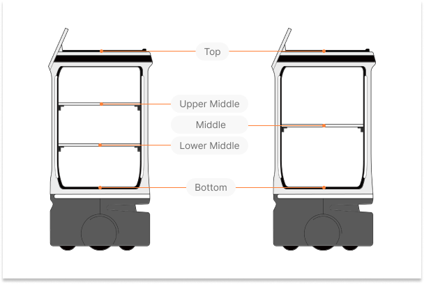
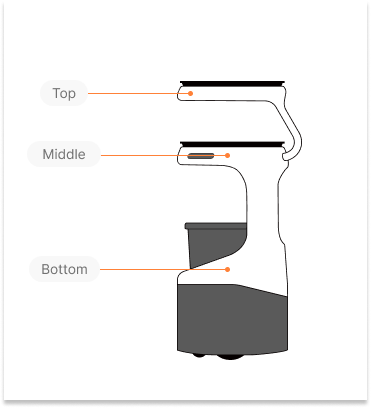
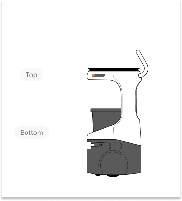

# Servi

These endpoints and their message types are only available for the Servi robot family. Attempting to run a Servi commands on a non Servi robot will result in an INVALID_ARGUMENT error.


------------
## CreateMission 
Use the shared `CreateMission` endpoint to send missions for Servi robots. Servi-specific missions must be sent using the appropriate request message format. <br/>

!!! Note
    When sending a Servi mission, `servi.Feedback` and `ServiType` are returned in [`SubscribeMissionStatus`](Mission.md#subscribemissionstatus) response message.
    
    ##### servi.Feedback `enum`

    | Name                   | Number | Description                                      |
    |------------------------|--------|--------------------------------------------------|
    | STATUS_UNKNOWN         | 0      | Default value. It means `status` field is not returned. |
    | STATUS_NAVIGATING      | 1      | The robot is currently navigating to its goal.|
    | STATUS_ARRIVED         | 2      | The robot has arrived at a goal. |
    | STATUS_DOCKING     | 3      | The robot is performing a docking maneuver.|
    | STATUS_UNDOCKING         | 4      | The robot is performing an undocking maneuver.|

    ##### ServiType `enum`

    | Name                   | Number | Description                                      |
    |------------------------|--------|--------------------------------------------------|
    | SERVI_TYPE_UNKNOWN     | 0      | Default value for servi type. |
    | SERVI_TYPE_SERVING     | 1      | A serving mission that navigates to goals, stopping until weight is removed. |
    | SERVI_TYPE_SERVING_PATROL | 2  | A serving patrol mission that continuously loops until all weight is removed. |
    | SERVI_TYPE_BUSSING     | 3      | A bussing mission that navigates to goals, stopping until weight is added. |
    | SERVI_TYPE_BUSSING_PATROL | 4  | A bussing patrol mission that continuously loops until weight exceeds threshold. |
    | SERVI_TYPE_NAVIGATE    | 5      | A single navigation mission with a predefined goal. |
    | SERVI_TYPE_NAVIGATE_AUTO | 6   | An automated navigation mission that selects the best available goal from a list. |


### Request
##### robot_id `string` `required`
The ID of the robot that will receive this command.


##### mission `Mission` `required`
Universal wrapper for mission types. Only one [mission type](../../concepts/mission.md#mission-types) may be set at a time.

| Field (*oneof*) | Message Type | Description |
|------------|-------------| ---|
|`base_mission`   |[`BaseMission`](Mission.md#base_mission-basemission)	| Base missions are applicable to all robot families. <br /> Refer to [Mission](Mission.md) for how to create and send a base mission.|
|`servi_mission`	|[`servi.Mission`](#servi_mission-servimission) | Servi missions are specific to the Servi robot family. |
|`carti_mission`	|[`carti.Mission`](Carti.md#carti_mission-cartimission)	| Carti missions are specific to the Carti robot family.<br /> Refer to [Carti](Carti.md) for how to create and send a carti mission. |


##### servi_mission `servi.Mission`
Use the field `servi_mission` to create and send a servi mission. Current API version supports 6 types of Servi mission.

| Field (*oneof*) | Message Type | Description |
|------------|-------------| ---|
|`delivery_mission`   |[`DeliveryMission`](#delivery_mission-deliverymission)	| Create a servi mission of type `Delivery`. |
|`bussing_mission`   |[`BussingMission`](#bussing_mission-bussingmission)	| Create a servi mission of type `Bussing`. |
|`delivery_patrol_mission`	|[`DeliveryPatrolMission`](#delivery_patrol_mission-deliverypatrolmission)| Create a servi mission of type `DeliveryPatrol`. |
|`bussing_patrol_mission`	|[`BussingPatrolMission`](#bussing_patrol_mission-bussingpatrolmission)| Create a servi mission of type `BussingPatrol`. |
|`navigate_mission`   |[`NavigateMission`](#navigate_mission-navigatemission)	| Create a servi mission of type `Navigate`. |
|`navigate_auto_mission`	|[`NavigateAutoMission`](#navigate_auto_mission-navigateautomission)| Create a servi mission of type `NavigateAuto`. |

##### bussing_mission `BussingMission`
A mission that navigates to one or more goals, stopping at each for a set amount of time or until some weight is added.

| Field | Message Type | Description |
|------|------|-------------|
|`goals`| *repeated* [`Goal`](Mission.md#goal-goal-required) <br />`required`| a list of `Goal` |
|`params`|`BussingParams`|  ***There is no param defined in this API version.*** |

##### Goal `Goal`
Represents a target destination or pose for the robot to navigate to.

| Field (*oneof*) | Message Type | Description |
|------|------|-------------|
|`destination_id`| `string` | ID of a predefined destination on the map. |
|`pose`| [`Pose`](Localization.md#pose) | Direct pose coordinates (x, y, heading). |

##### bussing_patrol_mission `BussingPatrolMission`
A mission that continuously loops through goals, stopping at each for a set amount of time or until weight exceeds a threshold.

| Field | Message Type | Description |
|------|------|-------------|
|`goals`| *repeated* [`Goal`](Mission.md#goal-goal-required) <br />`required`| a list of `Goal` |
|`params`|`BussingPatrolParams`|  ***There is no param defined in this API version.*** |

##### delivery_mission `DeliveryMission`
A mission that navigates to one or more goals, stopping at each for a set amount of time or until some weight is removed.

| Field | Message Type | Description |
|------|------|-------------|
|`goals`| *repeated* [`Goal`](Mission.md#goal-goal-required) <br />`required`| a list of `Goal` |
|`params`|`DeliveryParams`| Parameters for delivery mission. |

##### DeliveryParams `DeliveryParams`
Parameters for a delivery mission.

| Field | Message Type | Description |
|------|------|-------------|
|`tray_mappings`| *repeated* `TrayMapping` | Tray mappings for the delivery mission. Only supported for Servi+ robots. |

##### TrayMapping `TrayMapping`
Mapping between a given tray to a goal. Note: Tray mapping is only supported for Servi+ robots.

| Field | Message Type | Description |
|------|------|-------------|
|`tray_name`| `string` | Name of the tray. |
|`goal`| [`Goal`](Mission.md#goal-goal-required) | Target goal for this tray. |

##### delivery_patrol_mission `DeliveryPatrolMission`
A mission that continuously loops through goals, stopping at each for a set amount of time or until all weight is removed.

| Field | Message Type | Description |
|------|------|-------------|
|`goals`| *repeated* [`Goal`](Mission.md#goal-goal-required) <br />`required`| a list of `Goal` |
|`params`|`DeliveryPatrolParams`|  ***There is no param defined in this API version.*** |

##### navigate_mission `NavigateMission`
A mission consisting of a single, explicitly defined goal.

| Field | Message Type | Description |
|------|------|-------------|
|`goal`| [`Goal`](Mission.md#goal-goal-required) <br />`required`| Single target goal for navigation. |

##### navigate_auto_mission `NavigateAutoMission`
A mission that automatically selects the first unoccupied and unclaimed goal from the provided list, preferring goals with lower index values. For example, when sending a robot to one of several possible goals [T1, T2, T3], it will first check if T1 is unoccupied and unclaimed, then T2, and finally T3. If all goals are occupied or claimed, the mission will fail.

| Field | Message Type | Description |
|------|------|-------------|
|`goals`| *repeated* [`Goal`](Mission.md#goal-goal-required) <br />`required`| List of potential goals to choose from. |

##### JSON Request Example
=== "JSON"
    ```js
      {
        "robotId": "pennybot-456efg",
        "mission": {
          "serviMission": {
            "navigateMission": {
              "goal": {
                "pose": {
                  "xMeters": 2.5,
                  "yMeters": 1.8,
                  "headingRadians": 1.57
                }
              }
            }
          }
        }
      }
    ```

### Response
##### **mission_id** `string`
The ID of the mission created. 

##### JSON Response Example
=== "JSON"
    ```js
      {
        "missionId": "mission-abc123"
      }
    ```
### Errors

| ErrorCode  | Description |
|------------|-------------|
|`INVALID_ARGUMENT`      | This command is sending to is not a Servi family robot. |
|`FAILED_PRECONDITION`   |  The robot is already executing another mission. <br /> This command is valid if current mission is in [terminal state](Mission.md#state-enum), <br /> e.g Cancelled, Succeeded, Failed. |

-----------
## CalibrateTrays
Calibrates the trays on the robot.

Only applicable for tray-equipped robots (e.g., Servi, Servi Plus).

Calibrates all trays if no tray names are provided.
Returns an INVALID_ARGUMENT error and rejects the request if any tray name is invalid.
Returns an empty response on success.

### Request

##### robot_id `string` `required`
The ID of the robot to calibrate trays on.

##### selector `servi.TraySelector` `required`
Selector to specify which trays to calibrate.

| Field | Message Type | Description |
|------|------|-------------|
| `tray_names` | *repeated* `string` | List of tray names to calibrate. If empty, calibrates all trays. |

##### JSON Request Example
=== "JSON"
    ```js
      {
        "robotId": "pennybot-456efg",
        "selector": {
          "trayNames": ["top", "middle"]
        }
      }
    ```

### Response

*(No fields defined)*

##### JSON Response Example
=== "JSON"
    ```js
      {}
    ```

### Errors

| ErrorCode  | Description |
|------------|-------------|
| `INVALID_ARGUMENT` | This command is being sent to a non-Servi robot, or any tray name is invalid. |
| `PERMISSION_DENIED` | Attempting to calibrate trays for a `robot_id` you don't own. <br /> Tip: check the spelling of the `robot_id` value. |
| `NOT_FOUND` | The specified robot ID does not exist. |
| `INTERNAL` | Internal server error occurred while processing the request. |

-----------
## SubscribeTrayStatuses
Subscribes to the robot's tray status updates. <br />
Upon subscription, the latest known tray states are sent immediately. Updates are streamed when any tray state changes.

!!! Note
    Weight changes are reported with 10g precision.

### Request
##### selector `RobotSelector` `required`
`RobotSelector` is used to select specific robots. <br/>
 It supports selection by a list of robot IDs **OR** all robots at a given location.

| Field | Message Type | Description |
|------|------|-------------|
|`robot_ids`| `RobotIDs`| Selects robots by their specific IDs. <br/> Example: `["pennybot-123abc", "pennybot-abc123"]` |
|`location_id`|`string` |  Selects all robots at the specified location. |

##### JSON Request Example
=== "JSON"
    ```js
      {
        "selector": {
          "robotIds": {
            "ids": [
              "pennybot-456efg"
            ]
          }
        }
      }
    ```
### Response
##### tray_states `map<string, TrayStatesWithMetadata>`
A mapping of tray states reported by individual robots. Each entry pairs a robot ID (key) with its corresponding tray states.

##### TrayStatesWithMetadata
| Field | Message Type | Description |
|------|------|-------------|
| `metadata` | `EventMetadata` | Metadata associated with the tray states. |
| `tray_states` | [`TrayStates`](#traystate) | The tray states reported by the robot. |

##### TrayStates `TrayState` `repeated`
State of enabled trays, ordered from the top-most tray on the robot to the bottom.

##### TrayState
Represents the state of a single tray.

| Field | Message Type | Description |
|------|------|-------------|
| `tray_name`  | `string` |  Unique string name for the given tray. <br /> e.g. "top", "middle", "bottom" <br /> See [illustrations](#tray-configurations-on-different-servi-models) for tray configurations on different robot models.
| `load_state` | [`LoadState`](#loadstate-enum) *enum* | Current load state of the tray. |
| `weight_kg` | `float` | Weight on the tray in kilograms. Minimum precision is 10g. |
| `load_ratio` | `float` | Ratio of the current load to the tray's maximum load capacity.<br />This value may exceed 1.0 if the tray is overloaded.<br /> Caveats:<br>- If the maximum load is misconfigured (e.g., set to 0.0),<br />  this value may return NaN. |

##### LoadState `enum`
| Name                   | Number | Description                                      |
|------------------------|--------|--------------------------------------------------|
| LOAD_STATE_UNKNOWN          | 0      | Default value. It means the `load_state` field is not returned. |
| LOAD_STATE_LOADED          | 1      | The tray has a valid load.   |
| LOAD_STATE_EMPTY          | 2      | The tray is empty.             |
| LOAD_STATE_OVERLOADED           | 3      | The tray is carrying more than its maximum capacity.                     |

### Errors
| ErrorCode  | Description |
|------------|-------------|
|`INVALID_ARGUMENT`   | This command is sending to is not a Servi family robot. |
| `PERMISSION_DENIED` | Attempting to request status for a `robot_id` or `location_id` you don't own. <br /> Tip: check the spelling of all `robot_id` or `location_id` values.|
| `INTERNAL` | Internal server error occurred while processing the request. |

##### JSON Response Example
=== "JSON"
    ```js
    {
      "trayStates": {
        "pennybot-456efg": {
          "metadata": {
            "timestamp": "2025-04-01T16:00:00Z",
            "sequenceNumber": 105
          },
          "trayStates": [
            {
              "trayName": "top",
              "loadState": "LOAD_STATE_OVERLOADED",
              "weightKg": 8.1,
              "loadRatio": 1.18
            },
            {
              "trayName": "middle",
              "loadState": "LOAD_STATE_LOADED",
              "weightKg": 2.3,
              "loadRatio": 0.76
            },
            {
              "trayName": "bottom",
              "loadState": "LOAD_STATE_EMPTY",
              "weightKg": 0,
              "loadRatio": 0
            }
          ]
        }
      }
    }
    ```

##### Tray configurations on different Servi models
###### Servi Plus


###### Servi


###### Servi Mini

